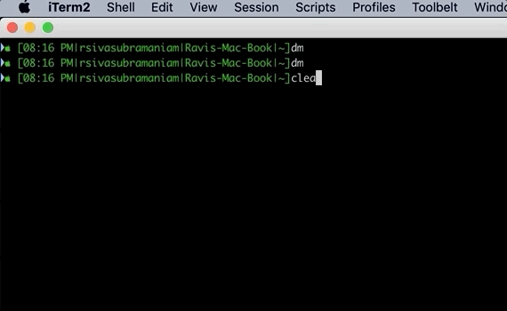

# How to toggle Drak Mode in MacOS Majove from the command line

Tag: Mac, Mojave, OSX, Tips And Tricks, Dark Mode

MacOS Mojave introduced system-wide Dark Mode and it looks absolutely gorgeous. With more apps jumping on to Dark Mode goodness, it’s just gonna get better. 

If you are a Mac user, there’s been little reason to get excited for new releases of macOS in recent years. If there is one reason to upgrade to Mojave, it is the dark mode. 

But enabling/disabling dark mode is a painful multi-step process of navigating through System Preferences / General / Appearance and then selecting Dark or Light. 


If you are like us ( ATD COE Advanced Analytics) impatient, always on the terminal, prefer CLI over GUI, then there should be no reason to do it this way. 

Here is the apple script to Toggle Dark Mode. This can be set up as an apple script and mapped to a key. You can read [here](https://www.macobserver.com/tips/quick-tip/change-light-dark-mode-applescript-app/). 

```shell
tell application "System Events"
    tell appearance preferences
        set dark mode to not dark mode
    end tell
end tell
```

Osascript is a command to run an AppleScript from the command line.  Let us convert the multi-line AppleScript to an "osascript" command. Since the Applescript to toggle Dark Mode is multi-line we will pass each line as a separate -e option. Here is the command line for toggling dark mode. 

```shell
osascript -e 'tell application \"System Events\"' -e 'tell appearance preferences' -e 'set dark mode to not dark mode' -e 'end tell' -e 'end tell'
```


Note: First time when you invoke this you will get an alert requesting permission to control system preferences from terminal hit ok if you are good with this. 

## Creat alias in  .bash_profile to assign shortcut to the osascript command. 

Add this to ~/.bash_profile
```shell
alias dm="osascript -e 'tell application \"System Events\"' -e 'tell appearance preferences' -e 'set dark mode to not dark mode' -e 'end tell' -e 'end tell'"
```

Reload
```shell
source ~/.bash_profile
```

Now you have the ability to toggle dark mode from command line. 




[](https://asciinema.org/a/241237)


