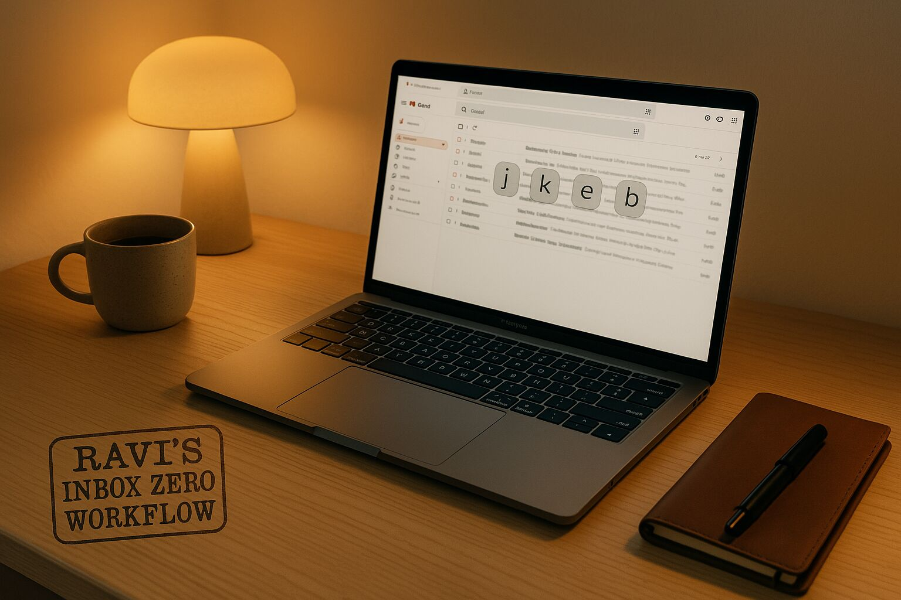

# Ravi’s Inbox Zero Workflow: Filters, Labels, and Shortcuts That Actually Work

Tag: gmail, Cheatsheet, Tips And Tricks, Productivity, Automation

> _Note: This workflow was originally created in 2016 and is being edited/republished in 2025._

In the early days of email—AOL, Yahoo, Hotmail—it felt exciting to get a message.  
Now, email is mostly noise. Work threads, newsletters, order confirmations, social updates, and spam pile up quickly. The inbox becomes unusable.

At one point, I had thousands of unread messages. Important emails would get buried.  
I needed a system—not a one-time cleanup, but a way to keep it under control.  
Gmail’s built-in features—**filters**, **labels**, and **keyboard shortcuts**—turned out to be enough.  
What used to take an hour now takes minutes.

This post shares how I use those features, with examples and a workflow that helps me get through email quickly every day.  
I have been sharing this cheat sheet with friends and family for years now.  
Here it is for everyone—I hope this helps.

---

## Prerequisite

> **Gmail Settings Tip:**  
> To use keyboard shortcuts, you need to enable them in Gmail settings first.  
> Go to **Gmail → Settings (⚙) → See all settings → General tab → Keyboard shortcuts → Turn ON**,  
> then scroll down and click **Save Changes**.

## Foundation: Filters and Labels

**Labels** are like folders, but more flexible. You can:
- Apply **multiple** labels to a single message
- Create **nested labels** (e.g., `orders/amazon`)
- Assign **colors** for quick visual scanning

**Filters** are rules that automatically sort incoming email based on sender, subject, keywords, attachments, etc.

I use filters and auto-labels to prioritize my inbox.  
This helps me visually scan and take action on important emails while filtering out routine or low-priority messages.

> **Note on Archiving**  
> The **Inbox** in Gmail shows only messages that are not archived.  
> When you **archive** an email, it's removed from the inbox but *not deleted*.  

So when a filter applies **“Skip the Inbox” + “Apply label”**, the message is out of sight, but still retrievable.

---

## My Workflow 

| If the selected email is...                        | Action to Take                            | Shortcut / Method                                |
|----------------------------------------------------|-------------------------------------------|--------------------------------------------------|
| Junk / No longer needed                           | **Delete it**                             | `#` (Shift + 3)                                  |
| Useful for reference, but needs no action         | **Archive it** (remove from inbox)        | `e`                                              |
| Belongs in a specific project/topic               | **Move to label** (archives + labels)     | `v` → type label name, `Enter`                   |
| Needs action, but not right now                   | **Snooze it** (hide until needed)         | `b` (then choose time)                           |
| —                                                 | _Pro Tip: Star (`s`) it first_            | I use this for tickets, appointments, etc.       |
| Important / Needs follow-up (not snoozed)         | **Star it**                               | `s`                                              |
| Needs to be read fully                            | **Open it**                               | `o` or `Enter`                                   |
| Finished with it                                  | **Archive / Delete / Move / Snooze**      | `e` / `#` / `v` / `b`                             |
| Go back to inbox list                             | **Return to inbox**                       | `u`                                              |
| Schedule a task/meeting from it                   | **Create calendar event**                 | Open → `⋮ More` → `Create event`                 |
| Made a mistake (archive/delete)                   | **Undo the last action**                  | `z`                                              |

---

## The Gmail Keyboard Shortcut Cheatsheet

| Key / Feature       | Action                          | Notes / My Use Case                         |
|---------------------|----------------------------------|---------------------------------------------|
| `j`                 | Move selection **down**         | Navigate email list                         |
| `k`                 | Move selection **up**           | Move back up the list                       |
| `o` / `Enter`       | **Open** conversation           | Read full email                             |
| `u`                 | **Return to inbox list**        | After opening or acting on email            |
| `x`                 | **Toggle selection**            | For bulk action                             |
| `e`                 | **Archive**                     | My most-used shortcut                       |
| `#` (Shift + 3)     | **Delete**                      | Remove irrelevant mail                      |
| `b`                 | **Snooze**                      | Hide now, show up later                     |
| `v`                 | **Move to...** label            | Archive + label in one                      |
| `l`                 | **Label as...** (no archive)    | Tag without moving                          |
| `s`                 | **Star / Unstar**               | Flag for later / mark important             |
| `!` (Shift + 1)     | **Report as spam**              | For junk / phishing                         |
| `z`                 | **Undo last action**            | Quick recovery from misclick                |
| `?` (Shift + /)     | **Show shortcut help**          | View all shortcuts in Gmail                 |

---

## Final Thoughts

This isn’t a complete system or productivity advice.  
Just what I do to keep email under control.

- **Filters** reduce inbox clutter  
- **Shortcuts** speed up triage  
- It took a bit of practice, but now it’s second nature

It’s not about perfection—I still occasionally have hundreds of emails.  
But the system helps me stay clear on what needs attention and what doesn’t.

Over time, **muscle memory builds**, and the process becomes natural.  
This isn’t rigid. It’s just structure that helps keep email manageable.

Use what’s useful. Skip what isn’t.