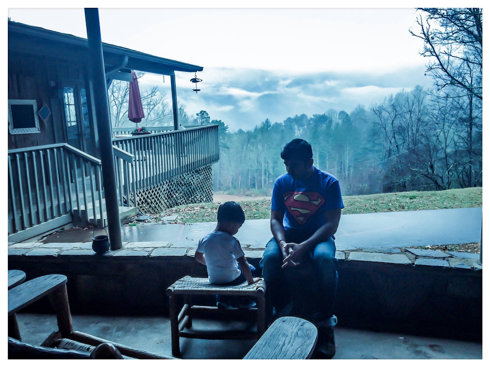

# Infinite Shades of being an Analog Father in a Digital World


When a child is born, a father is born. I do code for a living, but by far my most excellent “profession” involves raising my curious 7-year-old boy. My son makes me a better person every day. I consider myself a novice, shy writer; and yet, I was recently inspired to share my views on fatherhood and career after reading an article that claimed that kids can be detrimental to your professional life. I totally disagree with this point of view. This article encouraged me to do some self-reflection on how I have managed my life and career for the last 7 years. I understand that not everyone shares the same experience of parenthood and career. However, from my perspective, I have become a better person by sharing my life with my son, and it has tremendously helped me professionally. Here are some insights

```
Sometimes the smallest things take up the most room in your heart — Winne the Pooh
```

I have gained from being a father:

1. Responsibility: Being a father brings non-negotiable responsibility. With great responsibility comes great power. A Super Hero is born, and in my son’s eyes, it is me!

2. Communication: Simplify what you say to help your child understand. I have learned to communicate in simple terms, cutting out the use of acronyms and complex phrases.

3. Learning: With every challenging question, you have an option to shut down your kids’ quest. I have learned it is better yet to share in your kid’s curiosity and learn with them. Also, you are continually exploring and reinventing yourself to mentor and teach your child. With every class I enroll my son in, I get to help with his homework (which really is my homework).

4. Openness: Kids are so straightforward, and without filters, they ask some of the most direct, poignant, and thought-provoking questions. It for sure opens your mind and speaks to the soul. To be open to the questions is to be open to the answers.

5. Patience: This is one of the hardest nuts to crack in being a good parent. The achievement of parental patience will ensure you can unlock the zen level of infinity.

6. Saying No: It is very natural to say no to many things your kid does or wants, but being a good father is also about backing up your no response with facts and reasons when you say it.

7. Empathy: Being a parent makes you vulnerable and fearful, and you start developing compassion for others. This starts to show at work as you become more approachable and empathetic to others’ feelings. With every hug and kiss from my son, I feel empathy firsthand.

8. Role Model: Whether you like it or not, they emulate you. My son is always looking up to me as a role model. This has driven me to be a better person or, at least, the best version of myself.

9. Respect: Treating others with respect is what everyone idealizes, including children. If you want to bring up a respectful child, you realize treating your kid, your better-half, and the people around you with respect plays a significant role in the way your child respects you.

10. Collaboration/Teamwork: Collaboration is a fully loaded, adult term. Trust me, you don’t really realize what teamwork/collaboration truly is until you work with kids. Their drive for teamwork is built-in!

11. Humor: You will learn to be silly and enjoy it! Or at least I try to be funny or be made fun of. Life with your child doesn’t always have to be serious.

12. Expectations: What you expect when it comes to expectations changes with every milestone. You come to terms with this reality sooner or later as you experience the challenges you see your kid face. As a father, there is always something that doesn’t meet your expectations. You come to terms with this and learn to adapt to help your kid with the next challenge.

13. Spirituality: This is the most sticky subject, but having kids does drive you into spiritual thinking or belief in some superpower that will take care of your offspring.

14. Family: In relation to point 13, the superpower to care for your offspring is your family. As you create your new family, you gain a higher perspective on the value of your parents and extended family.

15. Experience: Being a father makes you hunt for the experiences you want to share with your kid. They are your partners in all that you have and haven’t had the chance to enjoy in life.

16. Money: Money is essential for survival, but time with your kids is priceless.

17. Introspection: Your mind becomes a self-introspection machine. I have explored my feelings about myself more often, feeling guilty, proud, inadequate, stupid, excellent… or like a Super Hero! It’s all part of growing as a father.

18. Love: Above all, I am learning every day the meaning of unconditional love period.

How did this all help in my career? There is no single ingredient to success, but emotional intelligence is vital. Corporates who live in ones and zeros spend millions to mentor and teach some of these learnings. There is increased clarity and direction in my decisions from these learnings. There are infinite numerals between one and zero. My career may be in the digital world, but my life as a father is analog!!

Thanks, Rachel E. Walters for helping with editing!