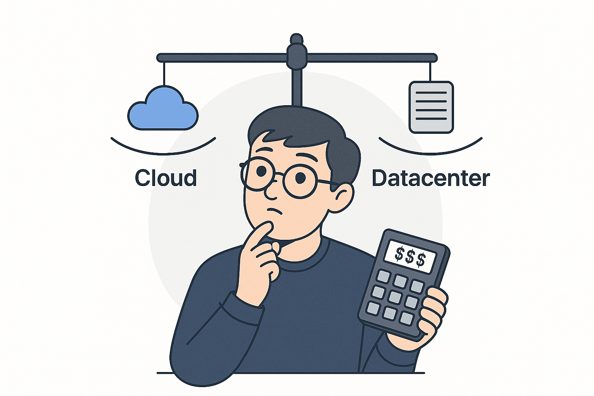

## Beyond the Hype: A Practical Guide to Cloud and Datacenter Decisions

The technology infrastructure landscape is perpetually in flux. Recent attention on companies like CoreWeave[($CRWV)](https://www.nasdaq.com/market-activity/ipos/financial-filings?dealId=1079716-113203), particularly following their recent IPO and focus on bare-metal GPU rentals for AI/ML workloads, has brought the long-standing datacenter versus cloud computing debate back into focus. While **hyperscalers** – massive-scale cloud providers like AWS and Azure known for their vast global infrastructure and comprehensive service suites – offer predominantly virtualization-based services (alongside bare-metal options), the demand for raw compute power highlights diverse infrastructure needs. This necessitates a clear-eyed look at the fundamental trade-offs involved, moving beyond marketing hype to examine the practical implications for different business requirements.

### The Case for Cloud: Flexibility and Agility

Cloud computing's primary appeal lies in its adaptability, especially valuable for projects facing uncertainty or fluctuating demands.

* **Scalability:** The capacity to rapidly provision and de-provision resources (elasticity) is crucial during development, testing, and for applications with variable user load. This agility enables quick iteration and responsiveness.
* **Pay-as-you-go Model:** This operational expenditure (OpEx) model eliminates the large upfront capital expenditure (CapEx) typically required for hardware procurement. However, for consistent, high-utilization workloads, these recurring costs can eventually surpass the total cost of ownership for dedicated hardware.
* **Global Reach:** Major cloud providers maintain vast global networks of datacenters, enabling organizations to deploy services closer to end-users, potentially reducing latency and improving user experience.
* **Managed Services:** Cloud platforms offer a wide array of managed services (databases, queues, machine learning platforms, etc.) that can accelerate development by abstracting away underlying infrastructure management.

### The Case for Datacenters: Control and Predictability

For organizations with stable, predictable workloads, or those with specific performance, security, or regulatory requirements, traditional or co-located datacenters offer distinct advantages.

* **Control:** Direct ownership and management of hardware allow for deep customization of network and server configurations, potentially optimizing for specific performance characteristics.
* **Cost Efficiency (Long-Term):** For sustained, predictable workloads, the initial CapEx for hardware and facilities can lead to lower long-term costs compared to equivalent, continuously running cloud resources.
* **Predictable Performance:** Dedicated hardware can offer more consistent performance characteristics compared to multi-tenant virtualized environments, although cloud providers also offer dedicated instances.
* **Data Residency & Security:** Direct control can simplify meeting strict data residency requirements and allows organizations to implement bespoke security measures.

### Cloud First, Datacenter Next: A Pragmatic Approach

Launching a new product—whether at a startup or within a big company—comes with a big challenge: predicting compute needs. How much processing power, storage, or bandwidth will you require? Guessing wrong can waste time and money, and locking into hardware early limits your ability to adapt. A smarter move? Start in the cloud, scale as you go, and optimize with a datacenter or tailored setup once you’ve got solid data.

**Why Forecasting Is Tough:** Estimating workloads for an untested product is a shot in the dark. Customer adoption, usage patterns, and shifting requirements defy precise planning. Build a datacenter too big, and you’re stuck with unused capacity; too small, and performance tanks when demand spikes. This uncertainty makes traditional infrastructure risky for new ventures.

**Cloud as an Initial Platform:** The cloud's elasticity and OpEx model mitigate this initial risk, allowing teams to scale resources based on *actual* usage data and user feedback, rather than projections. This facilitates experimentation and data gathering without significant upfront investment.

**Data-Driven Transition:** Once a product matures and usage patterns stabilize, the data collected during the cloud phase enables informed decisions about long-term infrastructure. This might involve:

1.  Optimizing cloud usage (right-sizing instances, using reserved instances/savings plans).
2.  Migrating specific, stable workloads to dedicated hardware (in a datacenter or co-location facility).
3.  Adopting a hybrid model, balancing cloud flexibility with datacenter control/cost-efficiency.

A notable example comes from Amazon's Prime Video Video Quality Analysis team. As detailed on their tech blog, they achieved significant cost savings (reportedly over 90% *for that specific service*) by re-architecting their audio/video monitoring service, moving components from a serverless approach (using Step Functions and distributed Lambda functions) to a more consolidated model running on EC2 and ECS, once usage patterns and bottlenecks were well understood.

### Key Considerations and Caveats

| Factor                      | Cloud Consideration                                                                 | Datacenter Consideration                                                                                       |
| :-------------------------- | :---------------------------------------------------------------------------------- | :------------------------------------------------------------------------------------------------------------- |
| **Cost Structure** | Variable OpEx can spiral without governance; potential for higher TCO on steady loads. | Significant CapEx & lead times; potentially lower TCO long-term for steady loads.                              |
| **Scalability & Agility** | Elastic scaling; complexity can increase with scale/abstractions.                 | Constrained by physical installs & planning cycles; less immediate elasticity.                               |
| **Maintenance & Operations**| Provider handles underlying infrastructure maintenance.                             | Requires dedicated resources & expertise for hardware/software upkeep, facilities management.                  |
| **Control & Customization** | Limited by provider offerings and abstraction layers.                               | Full hardware/software control allows deep customization.                                                      |
| **Security & Compliance** | Shared responsibility model; requires careful customer configuration & oversight.   | Full responsibility; direct control can simplify meeting specific residency or security requirements.          |
| **Platform Dependence** | Potential vendor lock-in via proprietary services complicates migration.             | Less platform lock-in, but dependent on specific hardware/software choices; migration still involves effort. |

### Real-World Perspectives

* **Prime Video (Monitoring Service):** As mentioned, their optimization illustrates how understanding specific workload characteristics can drive significant cost savings, sometimes involving shifts *within* or *away from* certain cloud architectures. 
[Prime Vidoe Tech Blog](https://www.primevideotech.com/video-streaming/scaling-up-the-prime-video-audio-video-monitoring-service-and-reducing-costs-by-90)
[Amazon Prime Statistics](https://www.searchlogistics.com/learn/statistics/amazon-prime-statistics/)

* **37signals (Basecamp/Hey):** Their public decision to repatriate workloads from the cloud, citing substantial cost savings ($7 million over five years projected), underscores that for companies with predictable usage and the necessary scale/expertise, owning hardware can be significantly more economical.[Hey Blog](https://world.hey.com/dhh/we-have-left-the-cloud-251760fb)

* **Bare Metal Cloud (e.g., CoreWeave, Equinix Metal):** These providers aim to bridge the gap, offering the raw performance and control closer to dedicated hardware but with cloud-like provisioning and OpEx models. They are particularly appealing for several use cases:
    * **Foundational Layer:** Serving as automated hardware for building private clouds or running specific orchestration layers (like VMWare, OpenStack, Kubernetes).
    * **High-Performance Needs:** Addressing sustained, predictable performance requirements often best met by dedicated, single-tenant hardware without a virtualization layer (common in HPC, Gaming, AI/Big Data, Finance).
    * **Security & Isolation:** Meeting strict trust, privacy, or regulatory mandates that necessitate dedicated, isolated environments rather than shared multi-tenant cloud resources.
    * **Specialized Requirements:** Supporting applications needing specific hardware features (GPUs, accelerators, encryption offload) or ultra-low latency not readily available or performant in standard virtualized environments (e.g., video transcoding, AR/VR, Telco workloads, AI/ML training/inference).

### Conclusion: Context is Key

The choice between cloud, datacenter, or a hybrid approach is not universally fixed but depends heavily on an organization's specific technical requirements, business goals, workload characteristics, budget, risk tolerance, and in-house expertise. A critical evaluation of the trade-offs, informed by real-world data and strategic planning, is essential. Often, a hybrid or multi-cloud strategy emerges as the most practical solution, leveraging the best of both worlds.

### Disclaimer

This blog does not examine CoreWeave’s valuation, financial performance, or specific business metrics. Rather, CoreWeave serves as a real-world example to facilitate a broader discussion on bare metal infrastructure versus cloud services. The emphasis is on technical and strategic aspects rather than financial details.
